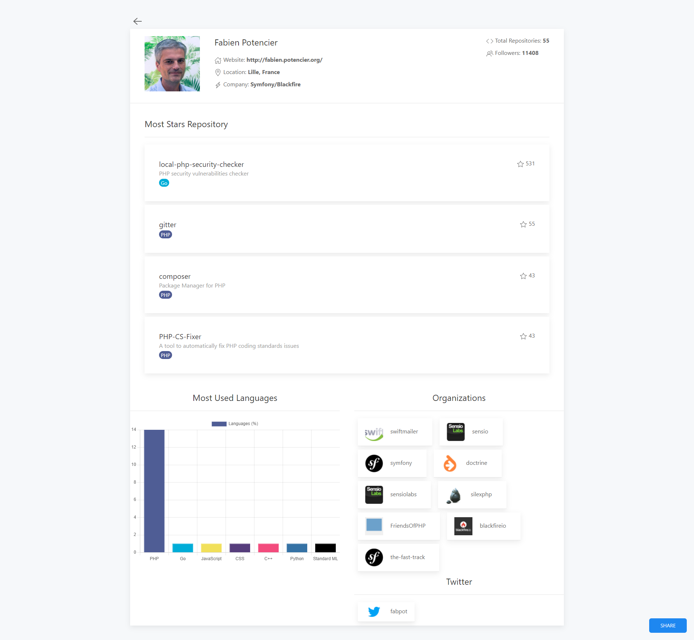

<h1 align="center">Welcome to github-app 👋</h1>
<p>
  <a href="https://www.npmjs.com/package/github-app" target="_blank">
    
  </a>
  <a href="#" target="_blank">
    
  </a>
  <a href="https://twitter.com/Skipperlla" target="_blank">
    
  </a>
</p>

> Github Profilinizin belirli parametrelerini alan ve size Github CV'si oluşturan bir uygulama

### ✨ [Demo](https://github-app-blue.vercel.app/)



## Install

```sh
npm install
```

## Run build

```sh
npm run build
```

## Author

👤 **Skipperlla**

* Website: https://www.skipperlla.xyz/
* Twitter: [@Skipperlla](https://twitter.com/Skipperlla)
* Github: [@Skipperlla](https://github.com/Skipperlla)

## Show your support

Give a ⭐️ if this project helped you!

***
_This README was generated with ❤️ by [readme-md-generator](https://github.com/kefranabg/readme-md-generator)_
